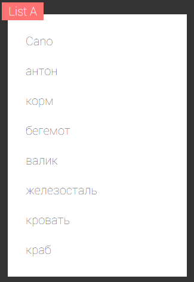
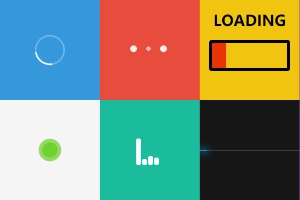
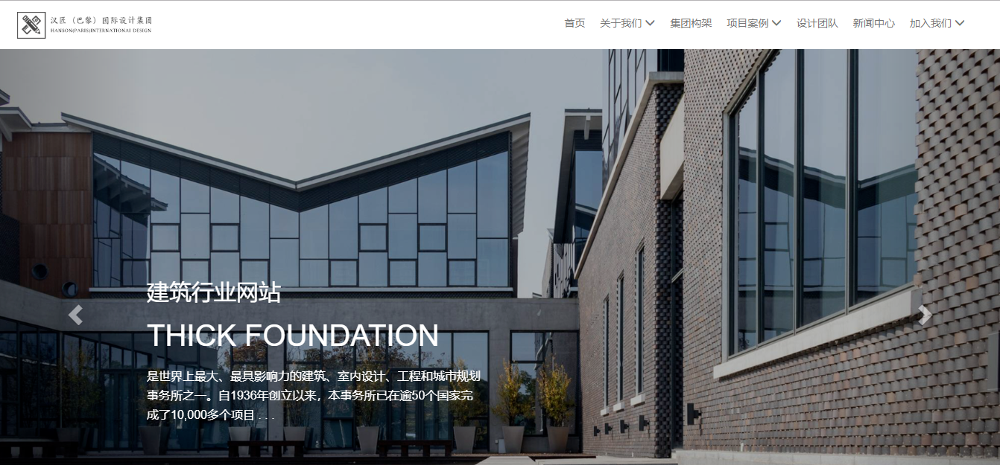
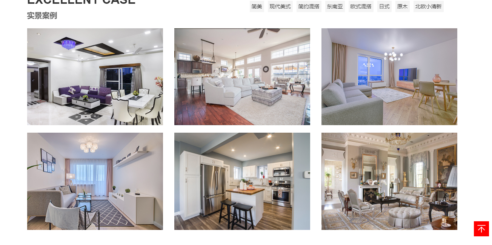

# 项目展示
***
## 种地网页

>**使用技术：**
>+ HTML
>+ CSS

>[查看详情](https://1924666540.github.io/cultivation/index.html " ")

>

***
## 菜单栏

>**使用技术：**
>+ HTML
>+ CSS：transform、transition

>[查看详情](https://1924666540.github.io/menu/index.html " ")

>

***
## 模拟京东图片放大镜效果

>**使用技术：**
>+ HTML
>+ CSS：posiiton、opacity
>+ jquery

>[查看详情](https://1924666540.github.io/amplifier/index.html " ")

>

***
## 图片对比效果

>**使用技术：**
>+ CSS:posiiton、transition、boxshadow
>+ jquery

>[查看详情](https://1924666540.github.io/contrast/index.html " ")

>

***
##  全屏滚动

>**使用技术：**
>+ HTML
>+ CSS:position、transition、transform
>+ jquery:自定义动画animate

>[查看详情](https://1924666540.github.io/FSS/index.html " ")

>

***

##  ihover特效

>**使用技术：**
>+ HTML
>+ CSS:position、transition、transform、opacity
>+ less
>+ jquery

>[查看详情](https://1924666540.github.io/ihover/index.html " ")

>

***
## 简易音乐播放器

>**使用技术：**
>+ HTML5:audio
>+ CSS3:transform、transition
>+ less
>+ jquery

>[查看详情](https://1924666540.github.io/audioPlayer/index.html " ")

>

***
## H5简易拖放列表

>**使用技术：**
>+ HTML5：drag、drop
>+ CSS:position、transition
>+ jquery

>[查看详情](https://1924666540.github.io/drag_drop/index.html " ")

>

***

## loading特效

>**使用技术：**
>+ HTML5:canvas、内联svg
>+ CSS:position、transition、animation
>+ JavaScript

>[查看详情](https://1924666540.github.io/loading/index.html " ")

>

***

## 环信IM模拟qq即时通讯

>**使用技术：**
>+ HTML
>+ CSS:position
>+ JavaScript
>+ 环信IM开发文档

>[查看详情](https://1924666540.github.io/MSN/index.html " ")

>

***
## 响应式网页

>**使用技术：**

>+ HTML5：header标签、footer标签、section标签
>+ CSS：transform、transition
>+ less
>+ jquery
>+ bootstrap

>### DEMO1

>[查看详情](https://1924666540.github.io/bootstrapDemo/demo1/index.html " ")

>

>### DEMO2

>[查看详情](https://1924666540.github.io/bootstrapDemo/demo2/index.html " ")

>

>### DEMO3

>[查看详情](https://1924666540.github.io/bootstrapDemo/demo3/index.html " ")

>

