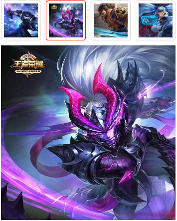

# 项目展示
***
## 种地网页

>*主要技术点：HTML、CSS*

>[点击这里查看详情](https://1924666540.github.io/cultivation/index.html " ")

>

***
## 模拟京东图片放大镜效果

>*主要技术点：HTML、CSS、jquery*

>[点击这里查看详情](https://1924666540.github.io/amplifier/index.html " ")

>

***
## 图片对比效果

>*主要技术点：HTML、CSS、jquery*

>[点击这里查看详情](https://1924666540.github.io/contrast/index.html " ")

>

***
## 简易音乐播放器

>*主要技术点：HTML5、CSS3、jquery、less*

>[点击这里查看详情](https://1924666540.github.io/audioPlayer/index.html " ")

>

***
## 响应式网页

>*主要技术点：HTML5、CSS3、jquery、less、bootstrap*

>### DEMO1

>[点击这里查看详情](https://1924666540.github.io/bootstrapDemo/demo1/index.html " ")

>

>### DEMO2

>[点击这里查看详情](https://1924666540.github.io/bootstrapDemo/demo2/index.html " ")

>

>### DEMO3

>[点击这里查看详情](https://1924666540.github.io/bootstrapDemo/demo3/index.html " ")

>

